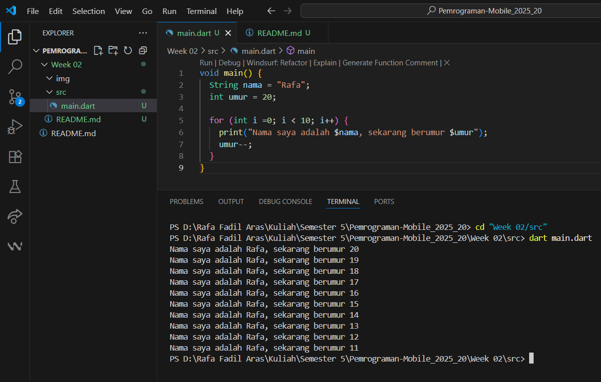
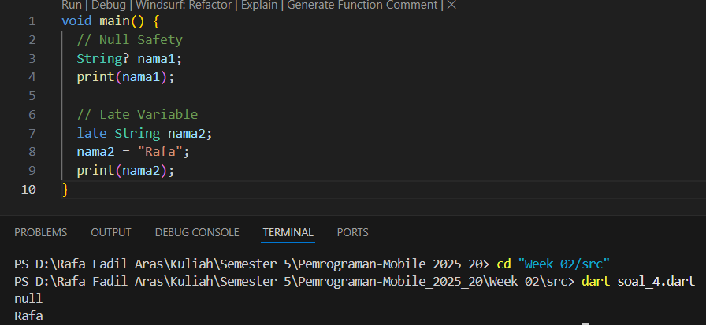

# Pemrograman Mobile - Pertemuan 2 

## Tugas Praktikum

**NIM  : 2341720007**
**Nama : Rafa Fadil Aras**

**Soal 1**
Modifikasi kode program 

**Jawaban** 
Hasil eksekusi kode program pada soal nomor 1 adalah teks yang menampilkan identitas (nama dan umur) secara berulang disertai dengan pengurangan nilai umur dalam setiap perulangan yang berjalan. Kode program ditulis dengan mendeklarasi variabel nama bertipe String, dan umur bertipe int, lalu program menggunakan perulangan for sebanyak 10 kali, mulai dari nilai i = 0 hingga i < 10. Pada setiap iterasi, perintah print mencetak teks yang berisi nama dan umur, kemudian perintah umur-- akan mengurangi 1 nilai umur. Hasilnya, menampilkan sepuluh baris teks yang dimulai dari umur 20 dan terus berkurang hingga umur 11. 

**Soal 2**
Jelaskan mengapa sangat penting untuk memahami bahasa pemrograman Dart sebelum kita menggunakan framework Flutter!
**Jawaban**
Karena dart merupakan inti dan dasar untuk bekerja dengan framework flutter, sehingga nanti nya pengembangan aplikasi dapat menjadi lebih mudah, efisien serta meminimalisir kesalahan saat menulis kode. 

**Soal 3**
Rangkuman materi Pengantar Bahasa Pemrograman Dart
**Jawaban**
Bahasa Dart adalah inti dari framework Flutter. Flutter membutuhkan bahasa tingkat tinggi. Dart bersifat OOP. Dart bertujuan untuk menggabungkan kelebihan-kelebihan dari sebagian bahasa tingkat tinggi dengan fitur bahasa pemrograman terkini, yaitu
- Productive tooling (memiliki tool yang lengkap)
- Garbage collection (dapat menangani dealokasi memori)
- Type annotations (variabel yang sudah di anotasikan tidak berubah) sehingga konsistenn dalam mengontrol semua data dalam aplikasi
- Statically typed (menemukan bug selama kompilasi kode)
- Portability (bahasa dart dapat dikompilasi secara native ke ARM)

Dart diluncurkan pada tahun 2011, dan merilis versi 2.0 pada akhir 2018. Awalnya dart ditujukan untuk menggantikan javascript, namun kini fokus mobile development melalui flutter. 

Dart dapat dieksekusi secara native melalui Dart VM dan diubah menjadi javascript untuk keperluan web. 
Kode Dart dapat dieksekusi pada lingkungan yang mendukung bahasa dart dengan memperhatikan fitur runtime systems, dart code libraries, dan garbage collector. Eksekusi kode dart dapat beroperasi dalam dua mode yaitu kompilasi Just-In-Time (JIT) atau kompilasi Ahead-Of-Time (AOT).

Dart operators
- Operator di Dart adalah method dengan sintaks khusus yang didefinisikan dalam class.
- Contoh: x == y sebenarnya memanggil method x.==(y).
- Semua tipe data di Dart adalah objek, sehingga setiap nilai memiliki method.
- Operator dapat dioverride agar perilakunya sesuai dengan logika yang diinginkan.

Arithmetic operators 
- + untuk tambahan
- - untuk pengurangan
- * untuk perkalian
- / untuk pembagian
- ~/ untuk pembagian bilangan bulat
- % untuk operasi modulus
- -expression untuk negasi

Shortcut operator : +=, -=, /=, ~/=

Operator increment dan decrement
- ++var atau var++ untuk menambah nilai variabel var sebesar 1
- --var atau var-- untuk mengurangi nilai variabel var sebesar 1

Operator Equality dan relational
- == untuk memeriksa apakah operan sama
- != untuk memeriksa apakah operan berbeda
- > untuk memeriksa apakah operan kiri lebih besar dari operan kanan
- < untuk memeriksa apakah operan kiri lebih kecil dari operan kanan
- >= untuk memeriksa apakah operan kiri lebih besar dari atau sama dengan operan kanan
- <= untuk memeriksa apakah operan kiri kurang dari atau sama dengan operan kanan

Operator Logical
- !expression negasi atau kebalikan hasil ekspresi (true menjadi false, dan sebaliknya)
- || menerapkan operasi logika OR antara dua ekspresi
- && menerapkan operasi logika AND antara dua ekspresi

**Soal 4**
Penjelasan dan contoh eksekusi kode tentang perbedaan Null Safety dan Late variabel!
**Jawaban**
- Null Safety : memastikan bahwa variabel tidak bisa menyimpan nilai null kecuali secara eksplisit diizinkan, variabel harus diinisialisasi sebelum digunakan
- Late Variabel : late digunakan untuk menundah inisialisasi variabel sampai saat pertama kali digunakan, dapat digunakan untuk variabel yang nilainya diketahui nanti (tidak saat deklarasi).
Kode dan hasil eksekusi : 