# Pemrograman Mobile - Pertemuan 3

**Nama : Rafa Fadil Aras**

**NIM  : 2341720007**

## Tugas Praktikum

**Soal 1**

Silakan selesaikan Praktikum 1 sampai 3, lalu dokumentasikan berupa screenshot hasil pekerjaan beserta penjelasannya!

**Jawaban :**

- **Praktikum 1** : Menerapkan Control Flows ("if/else")
    
    - Langkah 1

        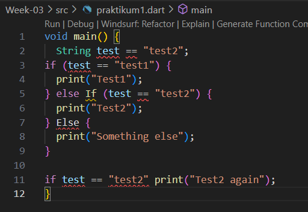

        ketika langkah 1 dijalankan, hasilnya error karena ada beberapa kesalahan penulisan sintaksis. 

        Perbaikan : 

        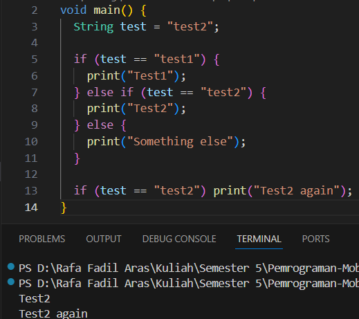

        Setelah kode diperbaiki, program dapat berjalan dan menampilkan 

    - Langkah 3

        saat dijalankan, error terjadi karena variabel test dideklarasikan dua kali dalam satu fungsi, sehingga variabel nya harus diganti menjadi test2 agar program dapat berjalan dan tidak error. 

        Perbaikan : 

        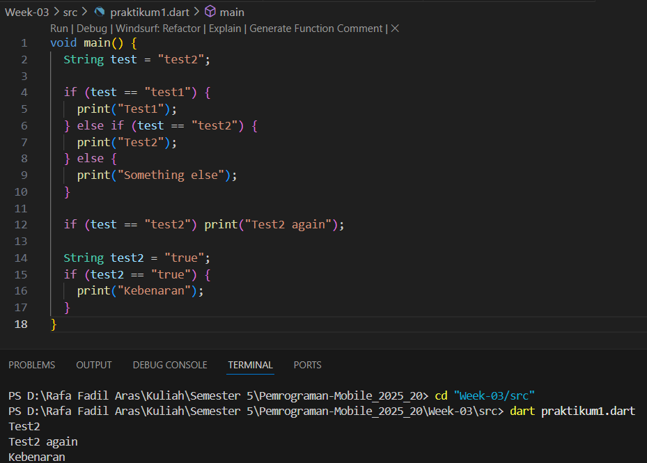

        Setelah dilakukan perbaikan tidak ada error lagi dan program dapat berjalan. 

- **Praktikum 2** : Menerapkan Perulangan "while" dan "do-while"
    
    - Langkah 1
  
        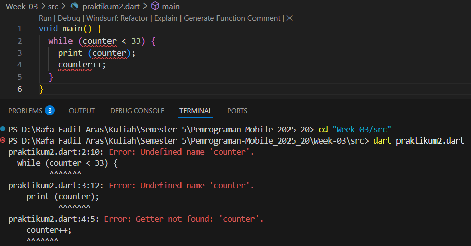

        ketika program dijalankan, muncul error karena variabel counter belum dideklarasikan dan diinisalisasi sebelum digunakan pada while loop. 

        Perbaikan : 

        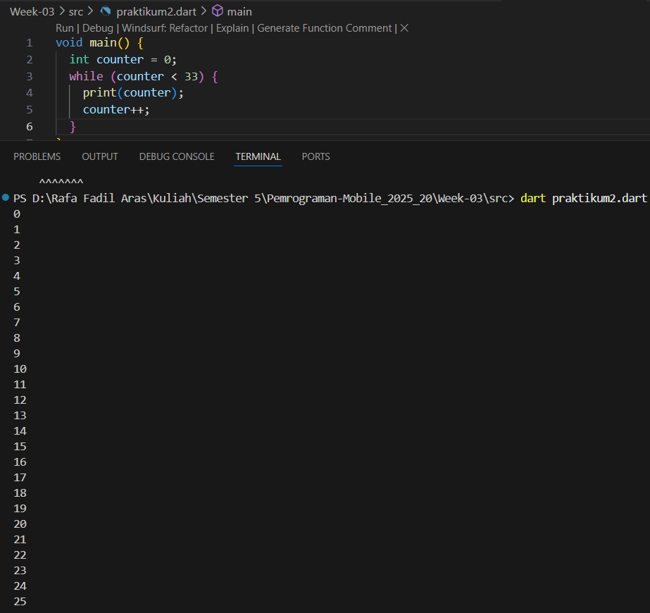

        Setelah dilakukan perbaikan, kode dapat berjalan tanpa error.

    - Langkah 3

        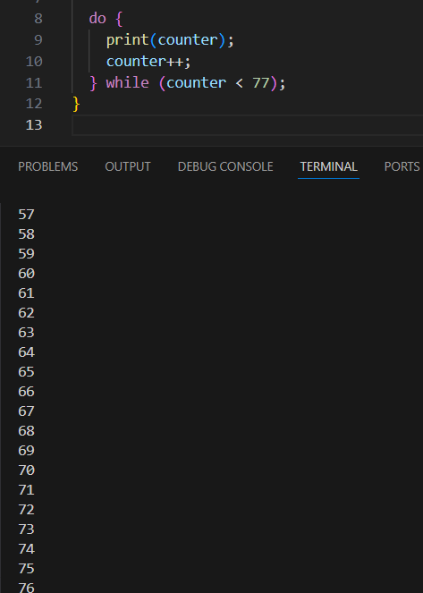

        penambahan kode ini mengacu pada penggunaan struktur perulangan do-while. Pada do-while, blok kode di dalam do akan dijalankan minimal satu kali, lalu kondisi pada while akan dicek. Jika kondisi true, blok do akan dijalankan lagi. 

- **Praktikum 3** : Menerapkan Perulangan "for" dan "break-continue"
    - Langkah 1

        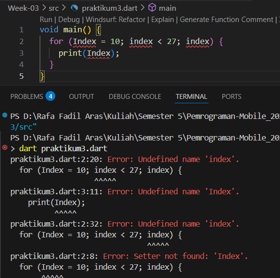

        Saat dijalankan, kode program tersebut error karena variabel pada for loop tidak dideklarasikan dengan benar, tidak ada increment dan penulisan variabel tidak konsisten. 

        Perbaikan : 

        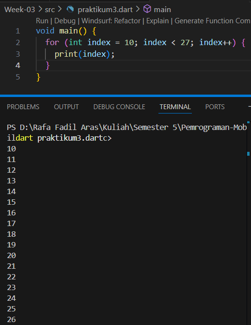

        setelah dilakukan perbaikan, kode program telah dituliskan dengan benar sintaksnya dan dapat dijalankan tanpa error. 

    - Langkah 3

        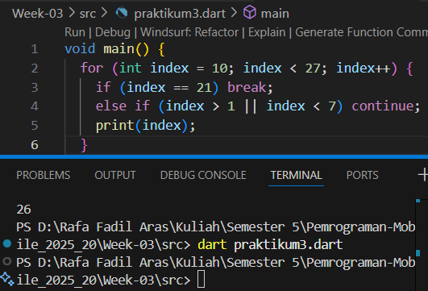

        Setelah dijalankan, tidak menampilkan hasil apapun, karena kondisi pada else if (index > 1 || index < 7) selalu bernilai true untuk semua nilai index dari 10 sampai 26, sehingga perintah continue selalu dijalankan dan print(index); tidak pernah dieksekusi. 

        Perbaikan : 

        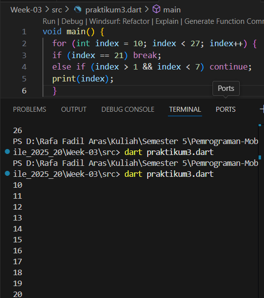

        Setelah perbaikan, hanya index 2 sampai 6 yang dilewati. Nilai index lain tetap dicetak. 

**Soal 2**

Buatlah sebuah program yang dapat menampilkan bilangan prima dari angka 0 sampai 201 menggunakan Dart. Ketika bilangan prima ditemukan, maka tampilkan nama lengkap dan NIM Anda.

**Jawaban :**

- Kode Program : 
  
    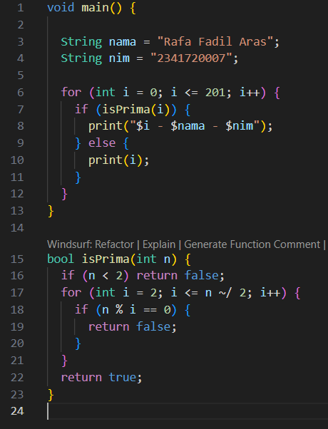

- Hasil :
    
    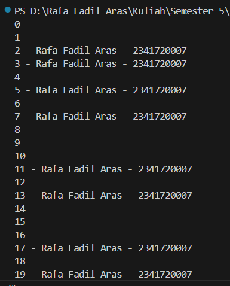

    Dari hasil running program tersebut, menampilkan angka bilangan prima, dan setiap bilang prima muncul diikuti dengan nim dan nama. 
    
