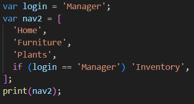

# Pemrograman Mobile - Pertemuan 4

**Nama : Rafa Fadil Aras**

**NIM  : 2341720007**

## Tugas Praktikum

### **Soal 1**

Selesaikan Praktikum 1 - 5, lalu dokumentasikan berupa screenshot hasil pekerjaan beserta penjelasannya!

**Jawaban :**

- **Praktikum 1** : Eksperimen Tipe Data List 
  - Langkah 1 
    Menulis kode 

    
  - Langkah 2
    Run kode pada langkah 1 

    Hasil : 
    
    

    Penjelasan : 
    pada langkah pertama ini, membuat list [1,2,3], lalu menampilkan panjang list dan isi elemen index ke-1 yaitu 2. Setelah elemen index ke-1 diubah menjadi 1, program menampilkan hasil 1. Sehingga output yang keluar adalah 3, 2, 1
  - Langkah 3 
    Mengubah kode menjadi variabel final yang mempunyai index = 5 dengan default value = null, lalu isi nama dan NIM pada elemen index ke-1 dan ke-2
    - Kode :
  
      
    - Hasil :
  
      

    - Penjelasan : 
      Pada percobaan ini, list diubah menjadi list yang mempunyai index 5 dengan default value null, lalu pada index ke 1 dan 2 diubah dengan nama dan NIM. 
- **Praktikum 2** : Eksperimen Tipe Data Set
  - Langkah 1
    Menulis kode 

    
  - Langkah 2
    Run kode pada langkah 1

    Hasil : 

    

    Penjelasan : Kode program tersebut membuat set berisi nama-nama halogen, saat dijalankan akan menampilkan isi dari set tersebut. 
  - Langkah 3
    Menambahkan kode program 

    

    Hasil

    

    Penjelasan : Pada percobaan ini, dibuat 3 variabel dengan names1 dan 2 sebagai String, names3 sebagai Map karena {} default nya adalah map. 

    Menambahkan elemen nama dan NIM pada kedua variabel set dengan fungsi berbeda. 

    Kode program : 

    

    Hasil : 

    

- **Praktikum 3** : Eksperimen Tipe Data Maps
  - Langkah 1
    Menulis kode 

    

  - Langkah 2
    Run kode pada langkah 1 

    

    Penjelasan : kode program ini mendefinisikan dua Map di dart (gift) dengan key berupa String dan nobleGases bengan key berupa angka, masing-masing menyimpan pasangan key-value. Saat di run, program menampilkan isi map dalam format {key:value}

  - Langkah 3
    Menambahkan kode program 

    

    Penjelasan : ketika ditambahkan kode tersebut, program tetap berjalan dan tidak ada error. Variabel mhs1 dan mhs2 berhasil dibuat sebagai map kosong dan belum diisikan data.

    Perbaikan dan penambahan kode program

    Kode program :

    

    Hasil : 

    

- **Praktikum 4** : Eksperimen Tipe Data List: Spread dan Control-flow Operators
  - Langkah 1
  
    Menulis kode program 

    

  - Langkah 2
  
    Run kode program langkah 1

    

    Penjelasan : pada saat kode dijalankan, ada sedikit kesalahan karena list1 belum pernah didefinisikan sebelum dipanggil. 

    Perbaikan : 

    

    

    Penjelasan : Setelah dilakukan perbaikan, kode berhasil dijalankan. Kode program tersebut membuat list [1,2,3] lalu menggunakan spread operator untuk membuat list baru [0, 1, 2, 3], kemudian menampilkan isi kedua list tersebut dan jumlah elemen pada list kedua yaitu 4.

  - Langkah 3
  
    Menambahkan kode program 

    

    hasil : 
    
    

    Menambahkan variabel list berisi NIM menggunakan Spread Operators

    kode program :

    

    hasil : 

    

  - Langkah 4
  
    Menambahkan kode program 

    

    Hasil : 
    - True
  
      
    - False 
  
      
    
    Penjelasan : 
    Kode program tersebut awalnya error, karena variabel promoActive digunakan tanpa dideklarasi terlebih dahulu. Setelah diperbaiki dengan mendeklarasikannya sebagai variabel boolean. Ketika diatur menjadi true, kondisi dalam list terpenuhi sehingga 'Outlet' ditambahkan, sedangankan ketika bernilai false, kondisi tersebut gagal dan 'Outlet' diabaikan.

  - Langkah 5 
  
    Menambahkan kode program 

    

    Hasil : 
    - Manager 

      

    - Admin 
  
      

    Penjelasan : 
    Jika variabel login = 'Manager' hasilnya adalah true, dan elemen 'Inventory' akan ditambahkan ke dalam list, namun jika variabel login berisi nilai lain, hasilnya adalah false dan elemen 'Inventory' tidak akan dimasukkan dalam list. 

  - Langkah 6

    Menambahkan kode program 

    

    Hasil 

    

    Penjelasan : Kode program memanfaatkan fitur collection for yang bermanfaat untuk membangun sebuah list baru dengan cara lebih ringkas dan mudah dibaca. Collection for memungkinkan untuk melakukan looping terhadap elemen dari koleksi lain dan menghasilkan elemen baru untuk list yang dibuat langsung di dalam deklarasinya. Manfaat utama nya adalah membuat kode lebih efisien karena tidak perlu lagi membuat list kosong dulu. 

- **Praktikum 5** : Eksperimen Tipe Data Records
  - Langkah 1

    Menulis kode 

    

  - Langkah 2
  
    Hasil run kode program :

    

    Penjelasan : record dalam Dart adalah sebuah fitur yang berfungsi untuk membungkus beberapa data dengan tipe data berbeda menjadi satu objek tunggal tanpa membuat sebuah class. 

  - Langkah 3
  
    Menambahkan kode program 

    

    hasil : 

    

  - Langkah 4
  
    Menambahkan kode program 

    

    hasil : 

    

  - Langkah 5
  
    Menambahkan kode program 

    

    hasil : 

    

### **Soal 2**

Jelaskan yang dimaksud Functions dalam bahasa Dart!

**Jawaban** 

Functions dalam bahasa Dart adalah blok kode yang bisa dipanggil untuk menjalankan tugas tertentu.

### **Soal 3**

Jelaskan jenis-jenis parameter di Functions beserta contoh sintaksnya!

**Jawaban**

Jenis-jenis parameter di Functions
- Positional parameter (urutannya harus benar)
  ```dart
  void cetak(String nama, int umur) {
    print("Nama: $nama, Umur: $umur");
  }
  ```
- Optional positional (boleh diisi boleh tidak)
  ```dart
  void salam([String? nama]) {
    print ("Halo ${nama ?? 'Guest'}");
  }
  ```
- Named parameter (memakai nama saat memanggil)
  ```dart
  void info({String? nama, int? umur}) {
    print("Nama: $nama, Umur: $umur");
  }
  ```

### **Soal 4**

Jelaskan maksud Functions sebagai first-class objects beserta contoh sintaksnya!

**Jawaban**

Arti functions sebagai first-class objects adalah function diperlakukan seperti data biasa yang bisa disimpan di variabel, dikirim sebagai parameter atau dikembalikan dari function. 
Contoh : 
```dart
void halo() => print("Hai Rafa!");
var f = halo;
f(); // memanggil halo
```

### **Soal 5**

Apa itu Anonymous Functions? Jelaskan dan berikan contohnya!

**Jawaban**

Anonymous Funtions adalah function tanpa nama yang biasanya langsung dipakai sekali jalan
Contoh : 
```dart
var angka = [1, 2, 3];
angka.forEach((n) {
    print (n*2);
});
```

### **Soal 6**

Jelaskan perbedaan Lexical scope dan Lexical closures! Berikan contohnya!

**Jawaban**

- Lexical scope adalah aturan variabel yang hanya bisa dipakai di blok tempat dia dibuat.
  Contoh : 
  ```dart
  void main() {
    var x = 10;
    void tampil() {
        print(x); // boleh akses karena masih dalam scope
    }
    tampil();
  }
  ```
- Lexical closure adalah function yang bisa mengingat variabel luar meskipun function luar sudah selesai. 
  Contoh : 
  ```dart
  Function hitung() {
    var counter = 0;
    return () {
        counter++;
        return counter;
    };
  }

    var tambah = hitung();
    print(tambah()); // 1
    print(tambah()); // 2
  ```

### **Soal 7**

Jelaskan dengan contoh cara membuat return multiple value di Functions!

**Jawaban**

Di dart, function haya bisa return satu  nilai, sehingga jika butuh mengembalikan beberapa nilai, bisa membungkus menjadi List, Map, atau Record. 


